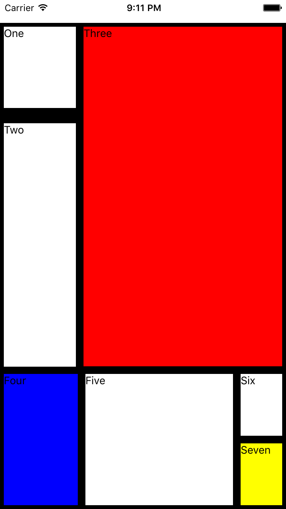

# react-native-workshop
Like it says on the tin.

## Instructions

Open the Tutorial project.

### Flexbox

- Edit the `app.js` file so that it's using the Mondrian component, e.g.

```
module.exports = Mondrian;
```

- Edit the `components/Mondrian/styles.js` file, until it looks like:



## Dictionary app

A dictionary app in ~330 lines of JavaScript, with React Native.
